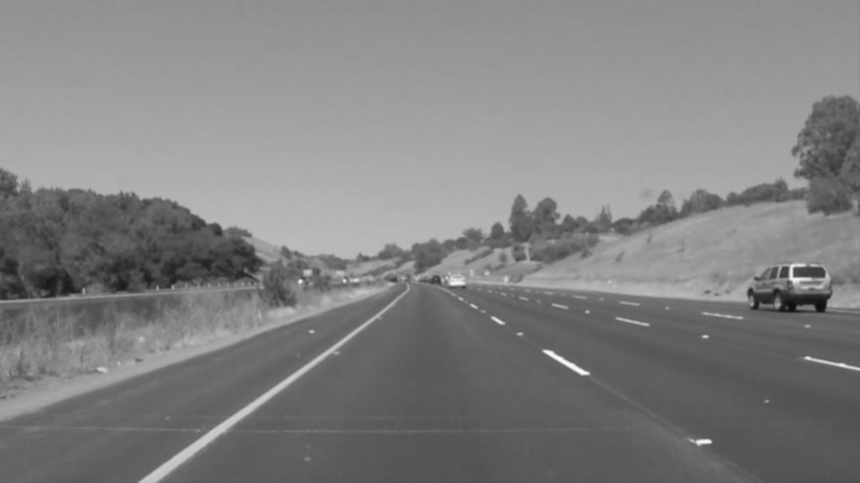
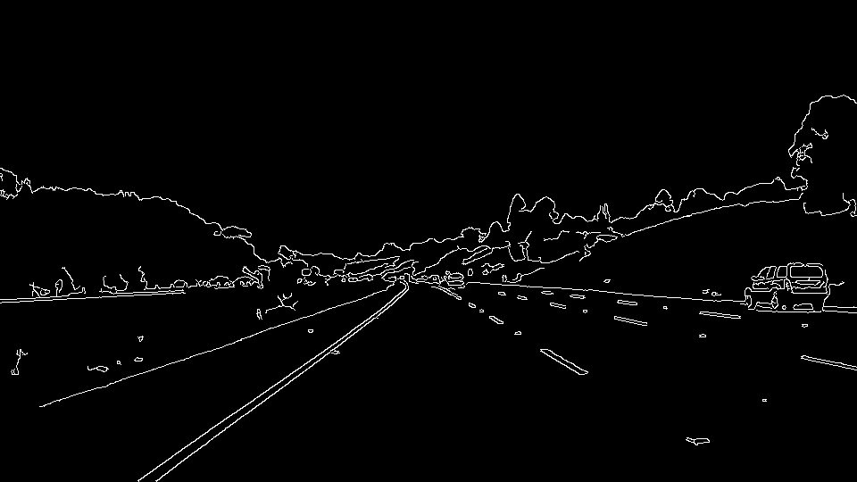
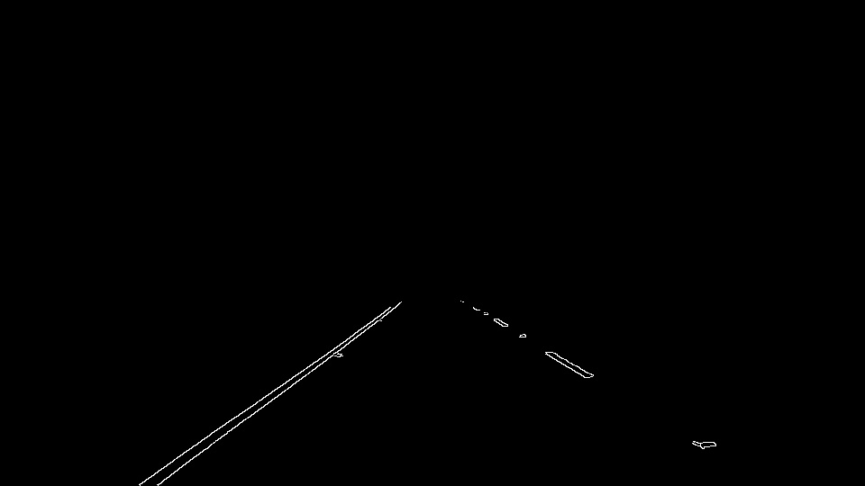
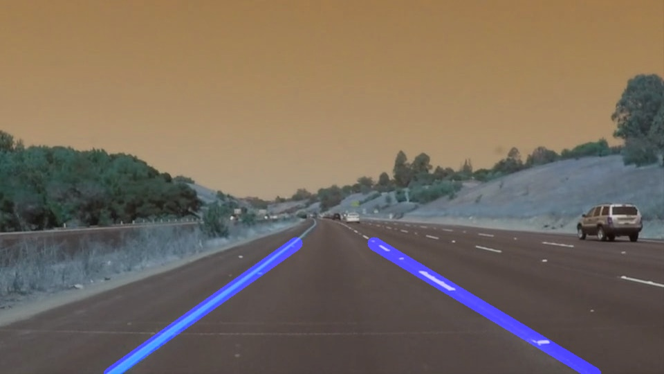

PROJECT WRITEUP
---

THE PIPELINE
---
The work flow of the pipeline is fairly basic when it comes to handling computer vision.

Pass image location to function 

Read image data using matplotlib command.

Make copies of image so the integrity of the original is not in question.
Pull dimensions of photo for use later.

Process first copy by first converting it to grayscale.

Smooth it with a gaussian filter. This will reduce the gradients and remove the smaller less important gradients

Pass to Canny function to detect the remaining gradients and highlight them in the image.

Create mask on image that was created from canny to remove everything from the picture except the region you care about...the lane lines and directly in front of the car.

Pass to Hough function...this will find lines created by continuous gradient values
Drawlines is called with in hough to draw the lines it finds.
Later iteration and final version draws to single lines that predict where the lane lines are even if there is only dashed lines.

Pass lines data to weighted image where it combines it with a copy of the original to see a normal image with lane line predictions overlaid.

For video processing this just loops thru each frame.

SHORTCOMINGS
---
Two shortcomings in regards to this build both happen within the draw_lines().

1. When the pipeline is processing video a couple of frames will drawn lines that are just off of the lines painted on the road.
This is definitely due to draw_lines(). Some of the filtering and calculation methods are unable to throw out bad slope calculations and find a more appropriate slope. It is a very calculation heavy function estimating slope, and the x points that will be drawn. 

I didn't want to use the same function that was given in the walkthrough video so I dug deep and built my own. From the looks of it the example method of calculating the slope and points creates a more reliable lines. But learned a lot about lines and manipulating data by building my own.

2. Currently cannot process the challenge video due to inability to throw out crazy slope calculations as mentioned earlier. 
draw_lines() does not handle bad slopes very well. When a filter is implemented to throw out bad slopes it ends up throwing all slopes. Not sure why logical operator is not handling good vs bad correctly. Need someone to bounce thoughts off of. Or spend a lot more time on this project than I have or was intended for this project.

NEXT ITERATION
---
1. Improve draw_lines() to handle issues mentioned above.
2. Figure out how to draw curved lines using functions other than point to point linear calculations.
